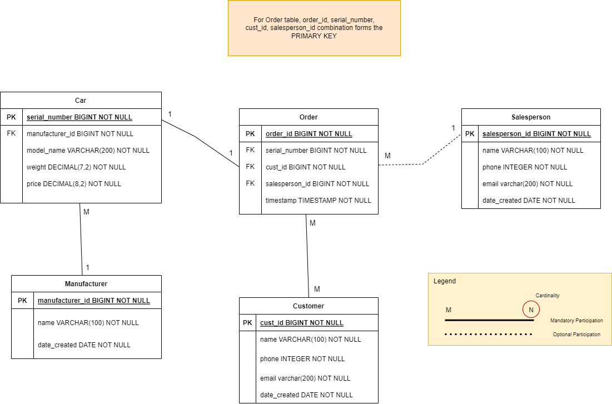

# GovTech-Tech-Challenge
Repository containing solutions to Data-Engineer-Tech-Challenge

The repo is structured in 5 different branches according to the challenge requirements  
1. data-pipelines
2. databases
3. sys-design
4. ~~charts-apis~~ (no time to attempt)
5. ~~ml~~ (no time to attempt)

## Databases Task
For this task, I have created the Entity-Relationship Diagram based on the requirements specified before 
creating the Dockerfile and DDL statements .sql file.
Based on some tutorials I found online, we can start Postgres with Docker Compose.  

## Run
Ensure Docker is running in the background, then do `$docker-compose up` to start the Postgres service up.
It will initialize the PostgreSQL db with the initial tables. 

## SQL Statements
I want to know the list of our customers and their spending.  
> SELECT * FROM customer cust LEFT JOIN  
> ( SELECT * FROM order o INNER JOIN car c ON o.serial_number = c.serial_number ) AS sub  
> ON cust.cust_id = sub.cust_id  
> GROUP BY cust.cust_id, price  

I want to find out the top 3 car manufacturers that customers bought by sales (quantity) and the sales number for it in the current month.
> SELECT manufacturer_id, count(*) FROM order o LEFT JOIN  
> ( SELECT * FROM car c INNER JOIN manufacturer m ON c.manufacturer_id = m.manufacturer_id ) AS sub  
> GROUP BY manufacturer_id
