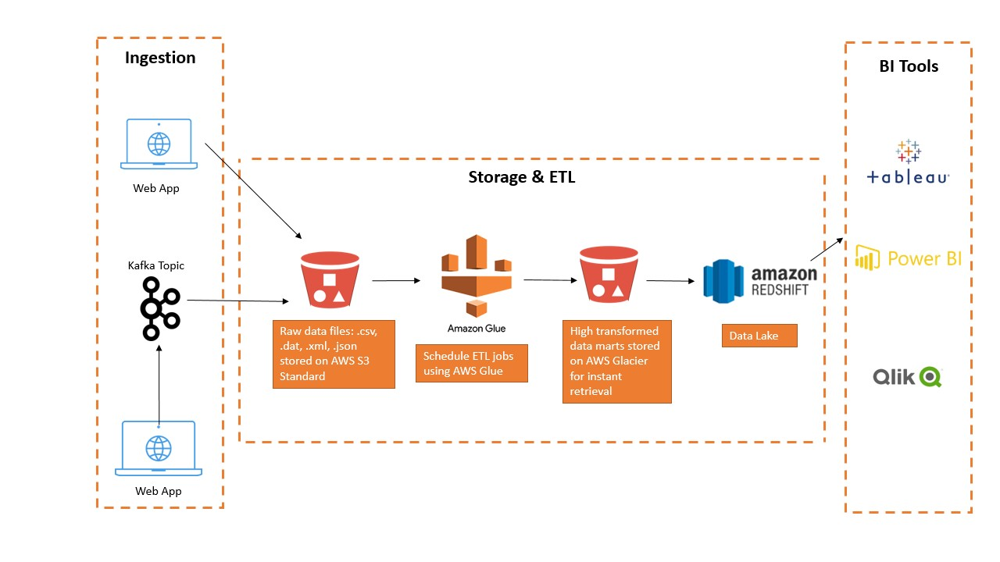

# GovTech-Tech-Challenge
Repository containing solutions to Data-Engineer-Tech-Challenge

The repo is structured in 5 different branches according to the challenge requirements  
1. data-pipelines
2. databases
3. sys-design
4. charts-apis
5. ml

## System Design Task

## Explanation
For this scenario, I feel that we can use some of the readily available cloud technologies such as AWS S3, AWS Glue, Amazon Redshift to do the job. 
The source data will come from two systems, the first would be an SFTP transfer from the Web Application, the second would be to consume it from a Kafka Topic for real-time data streaming.  
The raw data files, since mostly blob of images, will be sitting in an AWS S3 Bucket. Usually people would offer to store images on Azure Blob Storage, but as I am more familiar with AWS technology, I have designed this diagram based on my prior knowledge.  Then AWS Glue will be the ETL tool to extract, clean and transform the data. In this case, maybe there could even not have any ETL job at all since its images and not structured data. Then the transformed dataset would sit in an AWS S3 Glacier bucket for instant retrieval, which is resting in a data lake, in this case Amazon Redshift. 
Consumers are able to query some statistics on these datasets using BI tools like Tableau, QlikView or Power BI. 

## Pros
- Fast, instant retrieval. 
- Heavily integrated with AWS tech stack.
- Only management of the services deployed on AWS is required. 

## Cons
- Might be costly. 

